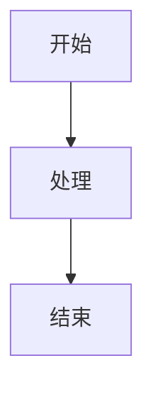
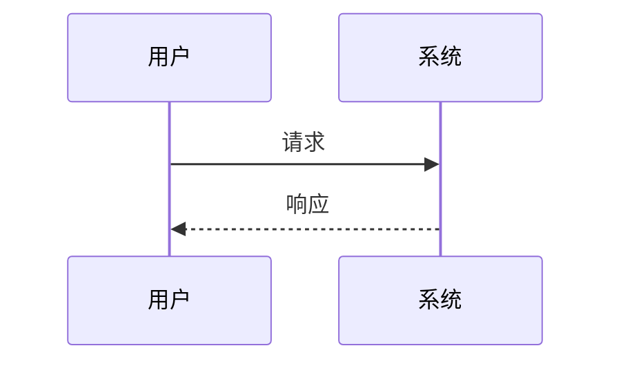
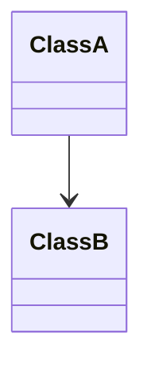

# 技术设计文档模板

## 文档结构

### 1. 文档头部
```markdown
# 技术设计文档 - [功能名称]

**版本**: v1.0
**创建日期**: YYYY-MM-DD
**最后更新**: YYYY-MM-DD
**作者**: [作者名称]
**状态**: Draft/Review/Approved
**需求文档**: [关联的spec.md版本]
```

### 2. 架构概览
```markdown
## 1. 架构概览

### 1.1 系统架构图
[使用Mermaid或文字描述的系统架构图]

### 1.2 技术栈选型
| 技术领域 | 技术选型 | 选型理由 |
|---------|---------|---------|
| 前端框架 | [框架名称] | [理由] |
| 后端框架 | [框架名称] | [理由] |
| 数据库 | [数据库类型] | [理由] |

### 1.3 目录结构
[项目的目录结构说明]
```

### 3. 核心模块设计
```markdown
## 2. 核心模块设计

### 2.1 [模块名称]

#### 2.1.1 模块职责
[描述模块的主要职责]

#### 2.1.2 类/组件设计
[类图或组件图]

#### 2.1.3 接口定义
```typescript
interface [InterfaceName] {
    // 接口定义
}
```

#### 2.1.4 数据流
[数据流图或说明]
```

### 4. 数据设计
```markdown
## 3. 数据设计

### 3.1 数据模型
[数据模型定义]

### 3.2 数据存储
[数据存储方案]

### 3.3 数据流转
[数据流转图]
```

### 5. API设计
```markdown
## 4. API设计

### 4.1 内部API
[内部模块间的API定义]

### 4.2 外部API
[与外部系统交互的API定义]

#### API-XXX: [API名称]
- **请求方法**: GET/POST/PUT/DELETE
- **请求路径**: /api/path
- **请求参数**: [参数说明]
- **响应格式**: [响应格式说明]
- **错误处理**: [错误处理说明]
```

### 6. 界面设计
```markdown
## 5. 界面设计

### 5.1 页面结构
[页面结构图或线框图]

### 5.2 交互流程
[用户交互流程图]

### 5.3 状态管理
[状态管理方案]
```

### 7. 性能设计
```markdown
## 6. 性能设计

### 6.1 性能目标
[性能指标和目标]

### 6.2 优化策略
[性能优化方案]

### 6.3 监控方案
[性能监控方案]
```

### 8. 安全设计
```markdown
## 7. 安全设计

### 7.1 安全威胁分析
[潜在安全威胁]

### 7.2 安全措施
[安全防护措施]

### 7.3 数据保护
[数据保护方案]
```

### 9. 部署设计
```markdown
## 8. 部署设计

### 8.1 部署架构
[部署架构图]

### 8.2 环境配置
[各环境配置说明]

### 8.3 部署流程
[部署步骤说明]
```

### 10. 测试策略
```markdown
## 9. 测试策略

### 9.1 单元测试
[单元测试策略]

### 9.2 集成测试
[集成测试策略]

### 9.3 端到端测试
[E2E测试策略]
```

## 设计图示规范

### Mermaid图表示例

#### 流程图


#### 序列图


#### 类图


## 接口定义规范

### TypeScript接口示例
```typescript
// 请求接口
interface Request {
    method: string;
    params: any;
}

// 响应接口
interface Response {
    code: number;
    message: string;
    data: any;
}

// 错误接口
interface Error {
    code: number;
    message: string;
    stack?: string;
}
```

## 数据模型规范

### 数据模型示例
```typescript
interface Entity {
    id: string;
    createdAt: Date;
    updatedAt: Date;
}

interface Fund extends Entity {
    code: string;
    name: string;
    type: string;
    // ...其他字段
}
```
