# 技术设计文档 - 场外基金收益计算器

**版本**: v1.0
**创建日期**: 2025-01-18
**最后更新**: 2025-01-18
**作者**: SDD Agent
**状态**: Draft
**需求文档**: spec.md v1.0

## 1. 架构概览

### 1.1 系统架构图

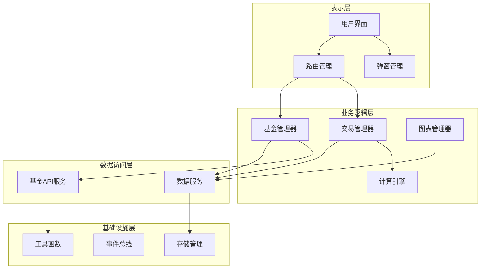

### 1.2 技术栈选型

| 技术领域 | 技术选型 | 选型理由 |
|---------|---------|---------|
| 前端框架 | 原生JavaScript | 零构建、零依赖、直接运行，参考股票计算器架构 |
| 图表库 | ECharts 5.x | 功能强大、性能优秀、支持响应式 |
| 数据存储 | localStorage | 浏览器原生支持、无需服务器、数据本地化 |
| 编码处理 | TextDecoder | 处理基金API的GB2312编码 |
| 架构模式 | 命名空间+模块化 | 参考股票计算器，清晰的结构和依赖管理 |

### 1.3 目录结构

```
fund-return-calculator/
├── index.html              # 主页面
├── css/
│   └── style.css          # 样式文件
├── js/
│   ├── app.js             # 应用入口
│   ├── router.js          # 路由管理
│   ├── fundManager.js     # 基金管理
│   ├── tradeManager.js    # 交易管理
│   ├── calculator.js      # FIFO计算引擎
│   ├── dataService.js     # 数据服务
│   ├── fundAPI.js         # 基金API服务
│   ├── chartManager.js    # 图表管理
│   ├── storage.js         # 存储管理
│   ├── eventBus.js        # 事件总线
│   ├── utils.js           # 工具函数
│   └── config.js          # 配置管理
├── lib/
│   └── echarts.min.js     # ECharts库
└── README.md              # 说明文档
```

## 2. 核心模块设计

### 2.1 基金管理模块 (FundManager)

#### 2.1.1 模块职责
- 管理基金信息的增删改查
- 调用基金API获取基金数据
- 维护基金列表状态
- 触发基金数据更新事件

#### 2.1.2 类设计

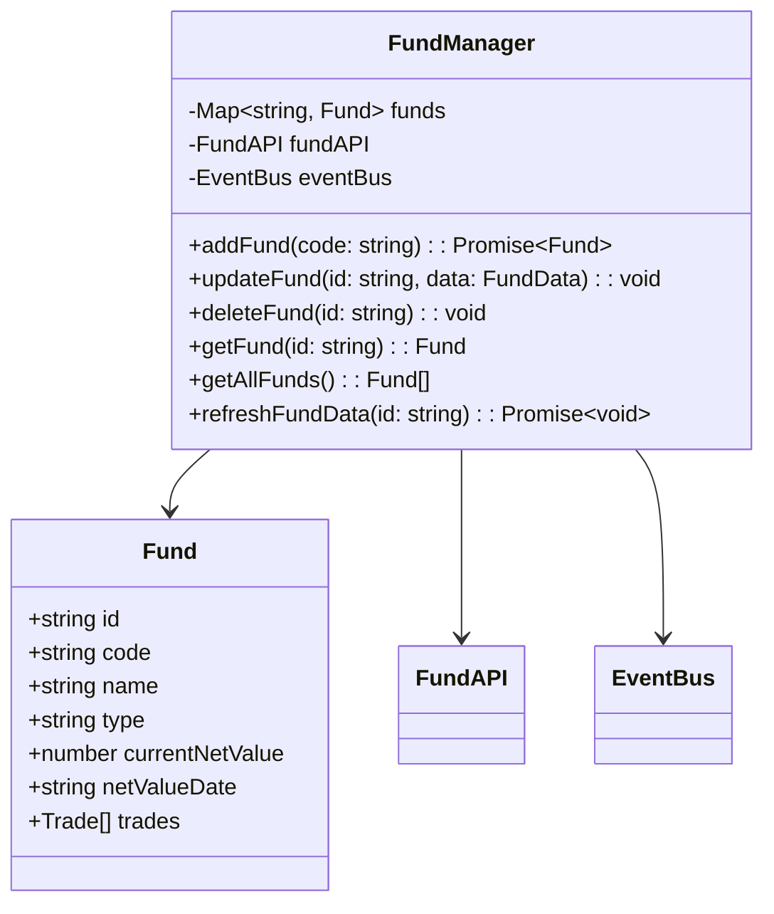

#### 2.1.3 接口定义

```typescript
// 基金信息接口
interface Fund {
    id: string;                  // 唯一标识
    code: string;                // 基金代码（6位数字）
    name: string;                // 基金名称
    type?: string;               // 基金类型
    currentNetValue?: number;    // 当前净值
    netValueDate?: string;       // 净值日期
    trades: Trade[];             // 交易记录
    createdAt: string;           // 创建时间
    updatedAt: string;           // 更新时间
}

// 基金API响应接口
interface FundAPIResponse {
    fundcode: string;            // 基金代码
    name: string;                // 基金名称
    jzrq: string;                // 净值日期
    dwjz: string;                // 单位净值
    ljjz: string;                // 累计净值
}
```

#### 2.1.4 数据流

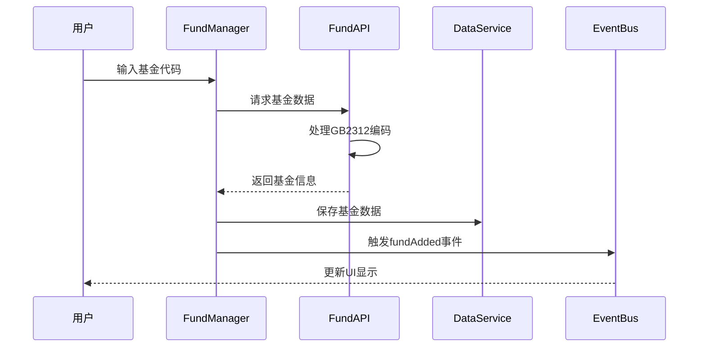

### 2.2 交易管理模块 (TradeManager)

#### 2.2.1 模块职责
- 管理交易记录的增删改查
- 验证交易数据合法性
- 触发收益重新计算
- 维护交易记录状态

#### 2.2.2 类设计

```mermaid
classDiagram
    class TradeManager {
        -DataService dataService
        -Calculator calculator
        -EventBus eventBus
        +addTrade(fundId: string, trade: TradeData): void
        +updateTrade(fundId: string, tradeId: string, data: TradeData): void
        +deleteTrade(fundId: string, tradeId: string): void
        +getTrades(fundId: string): Trade[]
        +validateTrade(trade: TradeData): boolean
    }

    class Trade {
        +string id
        +string date
        +TradeType type
        +number amount
        +number shares
        +number fee
        +string note
    }

    enum TradeType {
        BUY
        SELL
        DIVIDEND
    }

    TradeManager --> Trade
    TradeManager --> DataService
    TradeManager --> Calculator
```

#### 2.2.3 接口定义

```typescript
// 交易记录接口
interface Trade {
    id: string;                  // 唯一标识
    date: string;                // 交易日期
    type: TradeType;             // 交易类型
    amount: number;              // 交易金额
    shares: number;              // 交易份额
    fee: number;                 // 手续费
    note?: string;               // 备注
    createdAt: string;           // 创建时间
    updatedAt: string;           // 更新时间
}

// 交易类型枚举
enum TradeType {
    BUY = 'buy',                 // 买入
    SELL = 'sell',               // 卖出
    DIVIDEND = 'dividend'        // 分红
}

// 分红信息接口
interface DividendInfo {
    type: 'cash' | 'reinvest';   // 分红方式
    amount: number;              // 分红金额
    shares?: number;             // 红利再投份额
}
```

### 2.3 计算引擎模块 (Calculator)

#### 2.3.1 模块职责
- 实现FIFO成本计算算法
- 计算持仓收益和收益率
- 统计已实现收益
- 处理分红收益计算

#### 2.3.2 类设计

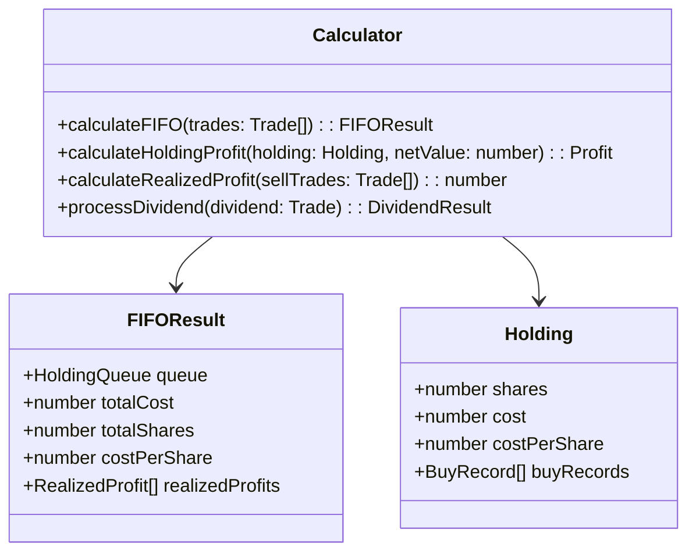

#### 2.3.3 接口定义

```typescript
// FIFO计算结果接口
interface FIFOResult {
    holdingQueue: BuyRecord[];       // 持仓队列（FIFO）
    totalCost: number;               // 总成本
    totalShares: number;             // 总份额
    costPerShare: number;            // 每份成本
    realizedProfits: RealizedProfit[]; // 已实现收益列表
}

// 买入记录接口
interface BuyRecord {
    tradeId: string;                 // 交易ID
    date: string;                    // 买入日期
    shares: number;                  // 份额
    cost: number;                    // 成本
    remainingShares: number;         // 剩余份额
}

// 已实现收益接口
interface RealizedProfit {
    sellTradeId: string;             // 卖出交易ID
    buyTradeId: string;              // 对应买入交易ID
    shares: number;                  // 卖出份额
    sellAmount: number;              // 卖出金额
    costAmount: number;              // 成本金额
    profit: number;                  // 收益
}

// 持仓收益接口
interface HoldingProfit {
    marketValue: number;             // 市值
    cost: number;                    // 成本
    profit: number;                  // 收益
    profitRate: number;              // 收益率
}
```

#### 2.3.4 FIFO算法流程

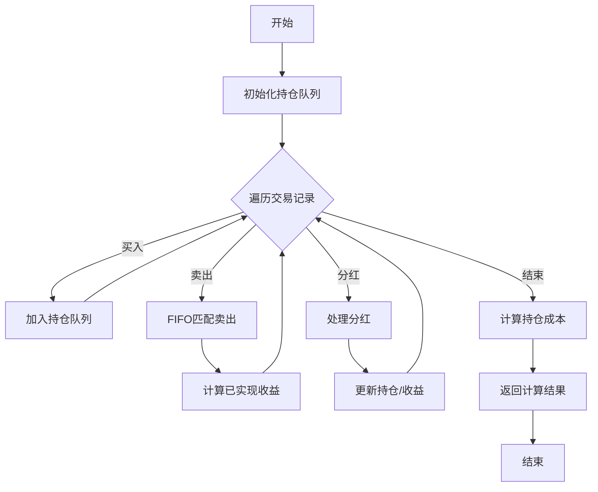

### 2.4 数据服务模块 (DataService)

#### 2.4.1 模块职责
- 统一数据访问接口
- 数据验证和转换
- 缓存管理
- 数据导入导出

#### 2.4.2 接口定义

```typescript
// 数据服务接口
interface DataService {
    // 基金数据
    getFund(id: string): Fund | null;
    getAllFunds(): Fund[];
    saveFund(fund: Fund): void;
    deleteFund(id: string): void;

    // 交易数据
    getTrades(fundId: string): Trade[];
    saveTrade(fundId: string, trade: Trade): void;
    deleteTrade(fundId: string, tradeId: string): void;

    // 数据导入导出
    exportData(): ExportData;
    importData(data: ExportData, mode: 'merge' | 'overwrite'): void;
}

// 导出数据接口
interface ExportData {
    version: string;             // 数据版本
    exportTime: string;          // 导出时间
    funds: Fund[];               // 基金数据
}
```

### 2.5 基金API服务模块 (FundAPI)

#### 2.5.1 模块职责
- 调用基金数据API
- 处理GB2312编码
- 请求重试机制
- 数据格式转换

#### 2.5.2 接口定义

```typescript
// 基金API服务接口
interface FundAPI {
    // 获取基金数据
    getFundData(code: string): Promise<FundAPIResponse>;

    // 批量获取基金数据
    batchGetFundData(codes: string[]): Promise<FundAPIResponse[]>;
}

// API配置接口
interface APIConfig {
    baseUrl: string;             // API基础URL
    timeout: number;             // 超时时间（毫秒）
    retryTimes: number;          // 重试次数
    retryDelay: number;          // 重试延迟（毫秒）
}
```

#### 2.5.3 编码处理流程

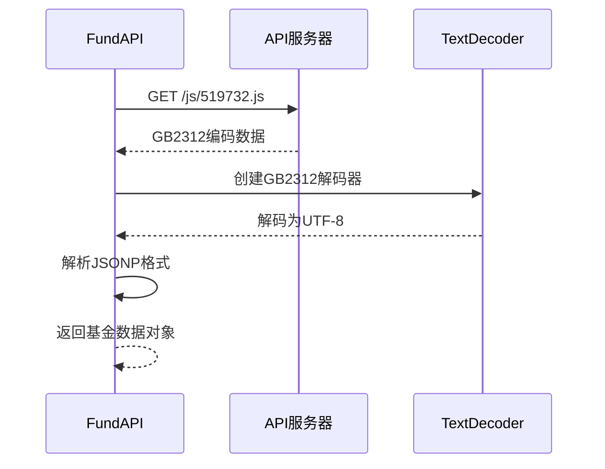

### 2.6 图表管理模块 (ChartManager)

#### 2.6.1 模块职责
- 管理ECharts实例
- 图表配置管理
- 响应式适配
- 主题切换

#### 2.6.2 接口定义

```typescript
// 图表管理器接口
interface ChartManager {
    // 创建图表
    createChart(container: HTMLElement, options: ChartOptions): ECharts;

    // 更新图表
    updateChart(chartId: string, options: ChartOptions): void;

    // 销毁图表
    destroyChart(chartId: string): void;

    // 响应窗口大小变化
    resize(): void;
}

// 图表配置接口
interface ChartOptions {
    type: 'line' | 'bar' | 'pie';    // 图表类型
    title: string;                    // 图表标题
    data: ChartData;                  // 图表数据
    theme?: 'light' | 'dark';         // 主题
}
```

## 3. 数据设计

### 3.1 数据模型

#### 3.1.1 核心数据模型

```typescript
// 应用数据模型
interface AppData {
    version: string;                  // 数据版本
    funds: Fund[];                    // 基金列表
    settings: AppSettings;            // 应用设置
    lastUpdated: string;              // 最后更新时间
}

// 应用设置接口
interface AppSettings {
    theme: 'light' | 'dark';          // 主题
    pageSize: number;                 // 分页大小
    defaultSortBy: string;            // 默认排序字段
}
```

#### 3.1.2 数据关系图

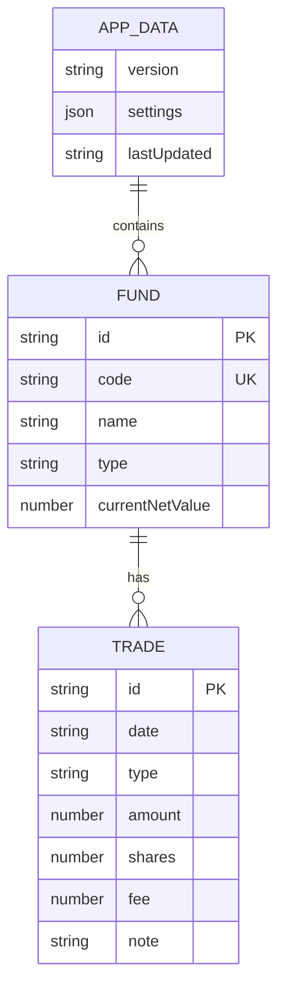

### 3.2 数据存储

#### 3.2.1 localStorage存储方案

```typescript
// 存储键定义
const STORAGE_KEYS = {
    APP_DATA: 'fund_calculator_data',     // 应用数据
    SETTINGS: 'fund_calculator_settings', // 应用设置
    CACHE: 'fund_calculator_cache'        // 缓存数据
};

// 存储管理器
class StorageManager {
    // 保存数据
    save<T>(key: string, data: T): void {
        try {
            const json = JSON.stringify(data);
            localStorage.setItem(key, json);
        } catch (error) {
            console.error('Storage save failed:', error);
            throw new Error('数据保存失败');
        }
    }

    // 读取数据
    load<T>(key: string): T | null {
        try {
            const json = localStorage.getItem(key);
            return json ? JSON.parse(json) : null;
        } catch (error) {
            console.error('Storage load failed:', error);
            return null;
        }
    }

    // 删除数据
    remove(key: string): void {
        localStorage.removeItem(key);
    }

    // 清空所有数据
    clear(): void {
        localStorage.clear();
    }
}
```

#### 3.2.2 数据迁移策略

```typescript
// 数据版本迁移
const DATA_VERSION = '1.0.0';

function migrateData(data: any): AppData {
    // 检查数据版本
    if (!data.version) {
        // 初始版本，无需迁移
        return data;
    }

    // 未来版本迁移逻辑
    // if (data.version === '1.0.0') {
    //     // 迁移到1.1.0
    // }

    return data;
}
```

### 3.3 数据流转

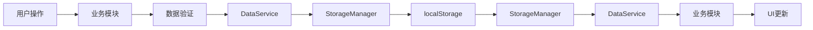

## 4. API设计

### 4.1 内部API

#### 4.1.1 事件总线API

```typescript
// 事件类型定义
enum EventType {
    FUND_ADDED = 'fund:added',
    FUND_UPDATED = 'fund:updated',
    FUND_DELETED = 'fund:deleted',
    TRADE_ADDED = 'trade:added',
    TRADE_UPDATED = 'trade:updated',
    TRADE_DELETED = 'trade:deleted',
    DATA_CHANGED = 'data:changed',
    ERROR = 'error'
}

// 事件总线接口
interface EventBus {
    // 订阅事件
    on(event: EventType, handler: Function): void;

    // 取消订阅
    off(event: EventType, handler: Function): void;

    // 触发事件
    emit(event: EventType, data?: any): void;
}
```

#### 4.1.2 模块间通信

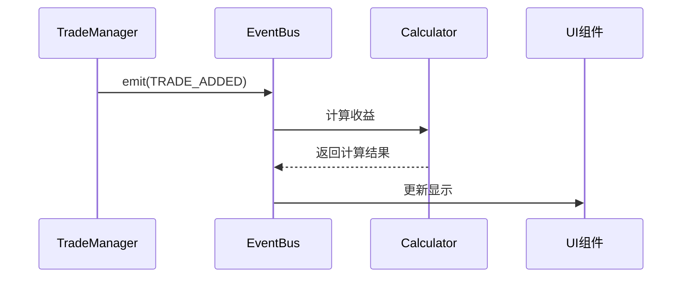

### 4.2 外部API

#### 4.2.1 基金数据API

**API-001: 获取基金信息**

- **请求方法**: GET
- **请求路径**: `http://fundgz.1234567.com.cn/js/{基金代码}.js`
- **请求参数**:
  - 基金代码：6位数字，路径参数

- **响应格式**: JSONP格式（GB2312编码）
```javascript
jsonpgz({
    "fundcode": "519732",      // 基金代码
    "name": "万家行业优选混合",  // 基金名称
    "jzrq": "2025-01-17",      // 净值日期
    "dwjz": "1.2345",          // 单位净值
    "ljjz": "2.3456"           // 累计净值
});
```

- **错误处理**:
  - 网络错误：重试3次，每次间隔1秒
  - 超时：5秒超时，提示"网络超时"
  - 基金不存在：提示"基金代码不存在"

#### 4.2.2 API调用流程

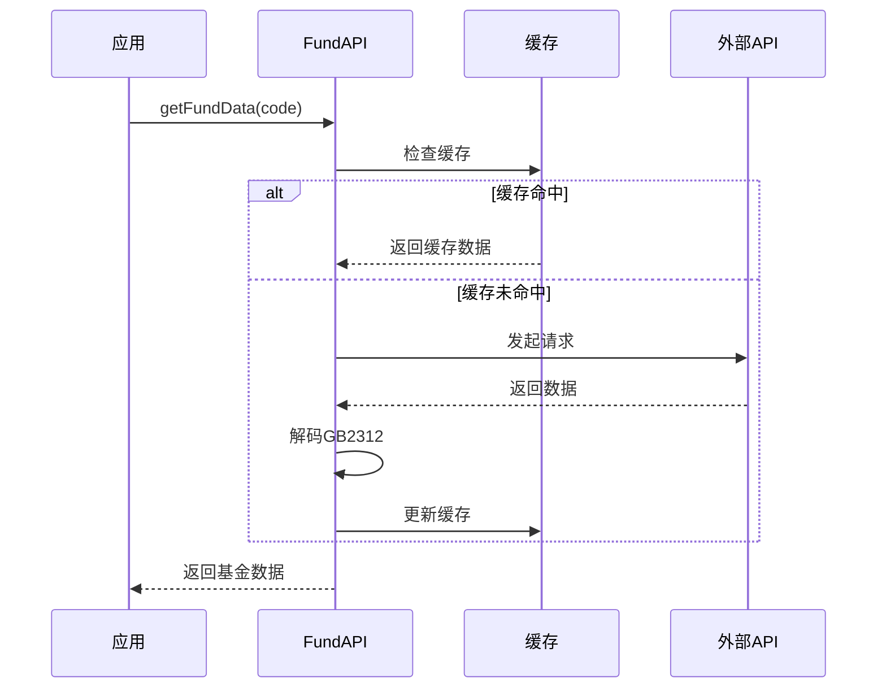

## 5. 界面设计

### 5.1 页面结构

#### 5.1.1 页面布局图

```
┌─────────────────────────────────────────┐
│           标题栏 (Header)               │
│  [返回] [标题] [设置] [导出]           │
├─────────────────────────────────────────┤
│                                         │
│         主内容区 (Main Content)         │
│                                         │
│  ┌─────────────────────────────────┐   │
│  │   汇总页 / 详情页               │   │
│  │                                 │   │
│  │   - 统计卡片                    │   │
│  │   - 基金列表                    │   │
│  │   - 图表区域                    │   │
│  │   - 交易记录表                  │   │
│  │                                 │   │
│  └─────────────────────────────────┘   │
│                                         │
├─────────────────────────────────────────┤
│         悬浮按钮区 (Float Buttons)      │
│              [添加基金]                 │
└─────────────────────────────────────────┘
```

#### 5.1.2 汇总页结构

```
汇总页 (Overview Page)
├── 统计卡片区
│   ├── 总投入
│   ├── 总市值
│   ├── 总收益
│   └── 总收益率
├── 基金列表区
│   ├── 持仓中基金
│   │   ├── 基金卡片1
│   │   ├── 基金卡片2
│   │   └── ...
│   └── 已清仓基金
│       ├── 基金卡片1
│       └── ...
└── 图表区
    ├── 收益趋势图
    └── 成本分布图
```

#### 5.1.3 详情页结构

```
详情页 (Detail Page)
├── 基金信息区
│   ├── 基金名称
│   ├── 当前净值
│   └── 净值日期
├── 持仓信息区
│   ├── 持有份额
│   ├── 持仓成本
│   ├── 持仓市值
│   ├── 浮动盈亏
│   └── 收益率
├── 收益统计区
│   ├── 已实现收益
│   ├── 总收益
│   └── 总收益率
├── 交易记录表
│   ├── 日期
│   ├── 类型
│   ├── 金额
│   ├── 份额
│   ├── 手续费
│   └── 操作
└── 图表区
    ├── 收益趋势图
    └── 成本趋势图
```

### 5.2 交互流程

#### 5.2.1 添加基金流程

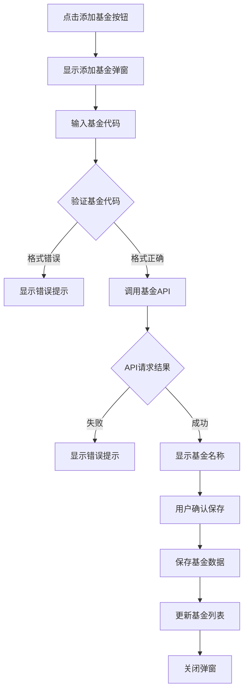

#### 5.2.2 添加交易记录流程

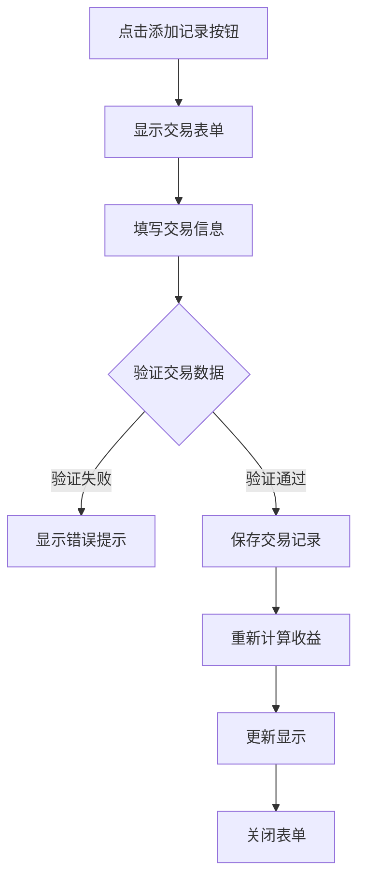

### 5.3 状态管理

#### 5.3.1 应用状态

```typescript
// 应用状态接口
interface AppState {
    // 当前页面
    currentPage: 'overview' | 'detail';

    // 当前选中的基金ID
    currentFundId: string | null;

    // 基金列表
    funds: Fund[];

    // 加载状态
    loading: boolean;

    // 错误信息
    error: string | null;

    // 设置
    settings: AppSettings;
}
```

#### 5.3.2 状态更新流程

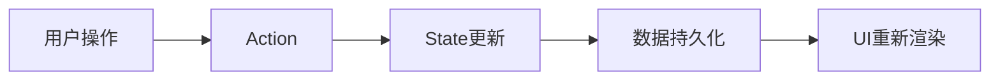

## 6. 性能设计

### 6.1 性能目标

| 性能指标 | 目标值 | 测量方法 |
|---------|--------|---------|
| 页面加载时间 | < 1秒 | Performance API |
| 操作响应时间 | < 200ms | 用户操作计时 |
| API请求超时 | 5秒 | fetch timeout |
| 图表渲染时间 | < 500ms | console.time |
| 数据计算时间 | < 100ms | console.time |

### 6.2 优化策略

#### 6.2.1 数据缓存

```typescript
// 缓存策略
interface CacheStrategy {
    // 基金数据缓存（5分钟）
    fundData: {
        ttl: 5 * 60 * 1000,
        maxSize: 100
    };

    // 净值数据缓存（1小时）
    netValue: {
        ttl: 60 * 60 * 1000,
        maxSize: 100
    };
}
```

#### 6.2.2 计算优化

```typescript
// 计算结果缓存
class CalculatorCache {
    private cache: Map<string, FIFOResult>;

    // 获取缓存
    get(tradeIds: string[]): FIFOResult | null {
        const key = this.generateKey(tradeIds);
        return this.cache.get(key) || null;
    }

    // 设置缓存
    set(tradeIds: string[], result: FIFOResult): void {
        const key = this.generateKey(tradeIds);
        this.cache.set(key, result);
    }

    // 清除缓存
    clear(): void {
        this.cache.clear();
    }
}
```

#### 6.2.3 渲染优化

```typescript
// 虚拟滚动（大量交易记录）
interface VirtualScroll {
    // 可见区域高度
    visibleHeight: number;

    // 每项高度
    itemHeight: number;

    // 总项数
    totalCount: number;

    // 计算可见项
    getVisibleItems(scrollTop: number): Trade[];
}
```

### 6.3 监控方案

```typescript
// 性能监控
class PerformanceMonitor {
    // 记录操作耗时
    measure(name: string, fn: Function): any {
        const start = performance.now();
        const result = fn();
        const end = performance.now();
        console.log(`${name}: ${end - start}ms`);
        return result;
    }

    // 记录页面加载
    measurePageLoad(): void {
        window.addEventListener('load', () => {
            const timing = performance.timing;
            const loadTime = timing.loadEventEnd - timing.navigationStart;
            console.log(`Page load time: ${loadTime}ms`);
        });
    }
}
```

## 7. 安全设计

### 7.1 安全威胁分析

| 威胁类型 | 描述 | 风险等级 |
|---------|------|---------|
| XSS攻击 | 恶意脚本注入 | 中 |
| 数据泄露 | localStorage数据被读取 | 低 |
| API劫持 | 基金API被篡改 | 低 |
| 数据篡改 | localStorage数据被修改 | 低 |

### 7.2 安全措施

#### 7.2.1 输入验证

```typescript
// 输入验证器
class InputValidator {
    // 验证基金代码
    validateFundCode(code: string): boolean {
        return /^\d{6}$/.test(code);
    }

    // 验证金额
    validateAmount(amount: number): boolean {
        return amount >= 0 && amount <= 100000000; // 最大1亿
    }

    // 验证日期
    validateDate(date: string): boolean {
        const d = new Date(date);
        return d <= new Date(); // 不能晚于当前日期
    }

    // 防XSS
    sanitizeInput(input: string): string {
        return input
            .replace(/</g, '&lt;')
            .replace(/>/g, '&gt;')
            .replace(/"/g, '&quot;')
            .replace(/'/g, '&#x27;');
    }
}
```

#### 7.2.2 数据加密

```typescript
// 简单的数据混淆（非加密）
class DataObfuscator {
    // 混淆数据
    obfuscate(data: string): string {
        return btoa(encodeURIComponent(data));
    }

    // 解混淆数据
    deobfuscate(data: string): string {
        return decodeURIComponent(atob(data));
    }
}
```

### 7.3 数据保护

- **本地存储**：所有数据仅存储在用户本地localStorage
- **不上传服务器**：不向任何服务器上传用户数据
- **导出加密**：导出数据可选择加密保护
- **定期备份**：提醒用户定期导出数据备份

## 8. 部署设计

### 8.1 部署架构

```
┌─────────────────────────────────────┐
│         用户浏览器                  │
│  ┌───────────────────────────────┐ │
│  │   静态文件 (HTML/CSS/JS)      │ │
│  │   - index.html                │ │
│  │   - css/style.css             │ │
│  │   - js/*.js                   │ │
│  │   - lib/echarts.min.js        │ │
│  └───────────────────────────────┘ │
│                                     │
│  ┌───────────────────────────────┐ │
│  │   localStorage                │ │
│  │   - 基金数据                  │ │
│  │   - 交易记录                  │ │
│  │   - 应用设置                  │ │
│  └───────────────────────────────┘ │
└─────────────────────────────────────┘
         ↓
    外部API调用
         ↓
┌─────────────────────────────────────┐
│   基金数据API服务器                 │
│   http://fundgz.1234567.com.cn      │
└─────────────────────────────────────┘
```

### 8.2 环境配置

#### 8.2.1 开发环境

```javascript
// config.js - 开发环境
const config = {
    env: 'development',
    api: {
        baseUrl: 'http://fundgz.1234567.com.cn/js',
        timeout: 5000,
        retryTimes: 3
    },
    storage: {
        key: 'fund_calculator_dev'
    }
};
```

#### 8.2.2 生产环境

```javascript
// config.js - 生产环境
const config = {
    env: 'production',
    api: {
        baseUrl: 'http://fundgz.1234567.com.cn/js',
        timeout: 5000,
        retryTimes: 3
    },
    storage: {
        key: 'fund_calculator'
    }
};
```

### 8.3 部署流程

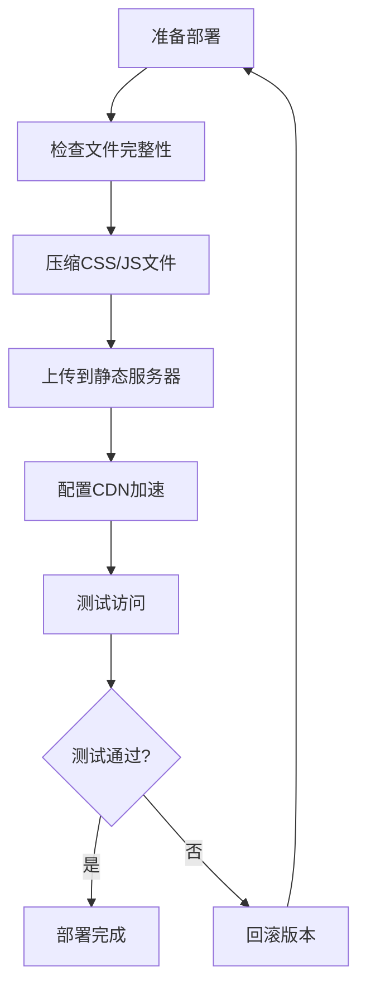

#### 8.3.1 部署步骤

1. **本地测试**
   ```bash
   # 使用本地服务器测试
   npx live-server .
   ```

2. **文件压缩**（可选）
   ```bash
   # 压缩CSS
   npx csso css/style.css -o css/style.min.css

   # 压缩JS
   npx uglifyjs js/*.js -o js/app.min.js
   ```

3. **部署到静态服务器**
   - GitHub Pages
   - Vercel
   - Netlify
   - 或任何静态文件服务器

4. **配置CDN**（可选）
   - 加速静态资源访问
   - 配置缓存策略

## 9. 测试策略

### 9.1 单元测试

#### 9.1.1 测试框架

使用 Jest 或 Mocha 进行单元测试

#### 9.1.2 测试用例

```typescript
// Calculator.test.js
describe('Calculator', () => {
    test('FIFO计算 - 正常买入卖出', () => {
        const trades = [
            { type: 'buy', shares: 1000, amount: 1000 },
            { type: 'buy', shares: 1000, amount: 1200 },
            { type: 'sell', shares: 1000, amount: 1500 }
        ];
        const result = Calculator.calculateFIFO(trades);
        expect(result.realizedProfit).toBe(500); // 1500 - 1000
    });

    test('FIFO计算 - 分红处理', () => {
        const trades = [
            { type: 'buy', shares: 1000, amount: 10000 },
            { type: 'dividend', amount: 200, dividendType: 'cash' }
        ];
        const result = Calculator.calculateFIFO(trades);
        expect(result.dividendProfit).toBe(200);
    });
});
```

### 9.2 集成测试

#### 9.2.1 测试场景

```typescript
// integration.test.js
describe('基金管理集成测试', () => {
    test('添加基金完整流程', async () => {
        // 1. 输入基金代码
        const code = '519732';

        // 2. 调用API获取数据
        const fundData = await FundAPI.getFundData(code);

        // 3. 保存基金
        FundManager.addFund(fundData);

        // 4. 验证保存结果
        const fund = DataService.getFund(fundData.id);
        expect(fund).toBeDefined();
        expect(fund.code).toBe(code);
    });
});
```

### 9.3 端到端测试

#### 9.3.1 测试工具

使用 Puppeteer 或 Cypress 进行E2E测试

#### 9.3.2 测试用例

```typescript
// e2e.test.js
describe('用户操作流程', () => {
    test('用户添加基金并查看收益', async () => {
        // 1. 打开应用
        await page.goto('http://localhost:3000');

        // 2. 点击添加基金按钮
        await page.click('#addFundBtn');

        // 3. 输入基金代码
        await page.type('#fundCodeInput', '519732');
        await page.click('#saveBtn');

        // 4. 验证基金已添加
        await page.waitForSelector('.fund-card');
        const fundName = await page.$eval('.fund-name', el => el.textContent);
        expect(fundName).toContain('万家行业优选');
    });
});
```

### 9.4 测试覆盖率

| 模块 | 目标覆盖率 | 优先级 |
|------|-----------|--------|
| Calculator | 90% | High |
| FundManager | 80% | High |
| TradeManager | 80% | High |
| DataService | 70% | Medium |
| FundAPI | 60% | Medium |
| ChartManager | 50% | Low |

## 10. 扩展性设计

### 10.1 插件系统

```typescript
// 插件接口
interface Plugin {
    name: string;
    version: string;
    install(app: App): void;
    uninstall(): void;
}

// 插件管理器
class PluginManager {
    private plugins: Map<string, Plugin>;

    register(plugin: Plugin): void {
        this.plugins.set(plugin.name, plugin);
        plugin.install(this.app);
    }

    unregister(name: string): void {
        const plugin = this.plugins.get(name);
        if (plugin) {
            plugin.uninstall();
            this.plugins.delete(name);
        }
    }
}
```

### 10.2 未来扩展点

1. **多账户支持**
   - 扩展数据模型，支持账户概念
   - 添加账户切换功能

2. **数据同步**
   - 支持云端数据同步
   - 多设备数据一致性

3. **高级分析**
   - 基金对比分析
   - 投资组合优化建议

4. **定投管理**
   - 定投计划设置
   - 自动记录定投交易
