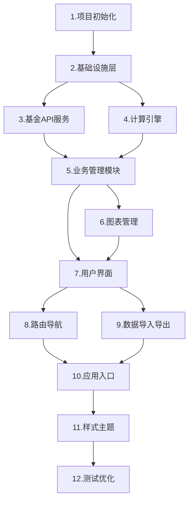

# 编码任务清单 - 场外基金收益计算器

**版本**: v1.0
**创建日期**: 2025-01-18
**最后更新**: 2025-01-18
**作者**: SDD Agent
**状态**: Draft
**需求文档**: spec.md v1.0
**设计文档**: design.md v1.0

## 任务概览

本文档将场外基金收益计算器的实现分解为可执行的任务清单，按照模块和功能进行组织，确保所有需求都能被完整实现。

**任务统计**：
- 主任务：12个
- 子任务：45个
- 预计工时：约15-20小时

## 1. 项目初始化和基础架构

### 1.1 创建项目基础结构
**任务描述**：搭建项目的基础目录结构和文件框架

**输入**：
- 技术设计文档中的目录结构规范

**输出**：
- 完整的项目目录结构
- 基础HTML、CSS、JS文件框架

**验收标准**：
- Given 创建项目目录
- When 执行任务
- Then 生成以下结构：
  - index.html（主页面）
  - css/style.css（样式文件）
  - js/目录（所有JS模块）
  - lib/目录（第三方库）

**优先级**: High
**预计工时**: 1小时

**实现步骤**：
1. 创建项目根目录
2. 创建css、js、lib子目录
3. 创建index.html基础框架
4. 创建style.css基础样式
5. 创建各JS模块的空文件

### 1.2 实现命名空间和模块注册系统
**任务描述**：创建全局命名空间和模块注册机制

**输入**：
- 参考股票计算器的namespace.js和moduleRegistry.js

**输出**：
- namespace.js：全局命名空间
- moduleRegistry.js：模块注册器

**验收标准**：
- Given 创建命名空间
- When 所有模块加载完成
- Then 所有模块都注册到全局命名空间FundCalculator

**优先级**: High
**预计工时**: 1小时

**代码生成提示**：
```javascript
// namespace.js
const FundCalculator = {
    version: '1.0.0',
    modules: {},
    register(name, module) {
        this.modules[name] = module;
    }
};

// moduleRegistry.js
const ModuleRegistry = {
    register(name, module) {
        FundCalculator.register(name, module);
    }
};
```

### 1.3 实现事件总线
**任务描述**：创建模块间通信的事件总线

**输入**：
- 设计文档中的EventType定义

**输出**：
- eventBus.js：事件总线实现

**验收标准**：
- Given 模块A订阅事件
- When 模块B触发事件
- Then 模块A收到事件通知

**优先级**: High
**预计工时**: 1小时

**代码生成提示**：
```javascript
const EventBus = {
    events: {},
    on(event, handler) {
        if (!this.events[event]) {
            this.events[event] = [];
        }
        this.events[event].push(handler);
    },
    emit(event, data) {
        if (this.events[event]) {
            this.events[event].forEach(handler => handler(data));
        }
    }
};
```

### 1.4 实现配置管理
**任务描述**：创建统一的配置管理模块

**输入**：
- 设计文档中的API配置和应用配置

**输出**：
- config.js：配置管理模块

**验收标准**：
- Given 应用启动
- When 读取配置
- Then 返回正确的API地址、超时时间等配置项

**优先级**: High
**预计工时**: 0.5小时

## 2. 基础设施层实现

### 2.1 实现工具函数库
**任务描述**：创建通用工具函数集合

**输入**：
- 常用工具函数需求（日期格式化、数字格式化等）

**输出**：
- utils.js：工具函数库

**验收标准**：
- Given 调用工具函数
- When 传入参数
- Then 返回正确格式化的结果

**优先级**: High
**预计工时**: 1小时

**代码生成提示**：
```javascript
const Utils = {
    // 日期格式化
    formatDate(date, format = 'YYYY-MM-DD') {
        // 实现日期格式化
    },

    // 数字格式化（保留小数位）
    formatNumber(num, decimals = 2) {
        // 实现数字格式化
    },

    // 金额格式化（千分位）
    formatMoney(amount) {
        // 实现金额格式化
    },

    // 生成唯一ID
    generateId() {
        return Date.now().toString(36) + Math.random().toString(36).substr(2);
    }
};
```

### 2.2 实现存储管理器
**任务描述**：创建localStorage存储管理模块

**输入**：
- 设计文档中的StorageManager接口

**输出**：
- storage.js：存储管理器

**验收标准**：
- Given 保存数据到localStorage
- When 读取数据
- Then 返回完整正确的数据

**优先级**: High
**预计工时**: 1小时

**代码生成提示**：
```javascript
const Storage = {
    save(key, data) {
        try {
            localStorage.setItem(key, JSON.stringify(data));
            return true;
        } catch (error) {
            console.error('Storage save failed:', error);
            return false;
        }
    },

    load(key) {
        try {
            const data = localStorage.getItem(key);
            return data ? JSON.parse(data) : null;
        } catch (error) {
            console.error('Storage load failed:', error);
            return null;
        }
    }
};
```

### 2.3 实现数据服务
**任务描述**：创建统一的数据访问服务

**输入**：
- 设计文档中的DataService接口定义

**输出**：
- dataService.js：数据服务模块

**验收标准**：
- Given 调用数据服务API
- When 执行增删改查操作
- Then 数据正确保存和读取

**优先级**: High
**预计工时**: 2小时

**子任务**：
- 2.3.1 实现基金数据的增删改查
- 2.3.2 实现交易记录的增删改查
- 2.3.3 实现数据导入导出功能
- 2.3.4 实现数据验证逻辑

## 3. 基金API服务实现

### 3.1 实现基金API调用
**任务描述**：创建基金数据API调用模块

**输入**：
- API地址：http://fundgz.1234567.com.cn/js/{code}.js
- API响应格式：JSONP（GB2312编码）

**输出**：
- fundAPI.js：基金API服务

**验收标准**：
- Given 输入基金代码"519732"
- When 调用API
- Then 返回基金名称"万家行业优选混合(LOF)"和净值数据

**优先级**: High
**预计工时**: 2小时

**子任务**：
- 3.1.1 实现API请求函数
- 3.1.2 实现GB2312编码处理
- 3.1.3 实现JSONP数据解析
- 3.1.4 实现请求重试机制
- 3.1.5 实现超时处理

**代码生成提示**：
```javascript
const FundAPI = {
    async getFundData(code) {
        const url = `http://fundgz.1234567.com.cn/js/${code}.js`;

        try {
            const response = await fetch(url);
            const buffer = await response.arrayBuffer();

            // GB2312解码
            const decoder = new TextDecoder('gb2312');
            const text = decoder.decode(buffer);

            // 解析JSONP
            const jsonStr = text.match(/jsonpgz\((.+)\)/)[1];
            const data = JSON.parse(jsonStr);

            return {
                code: data.fundcode,
                name: data.name,
                netValue: parseFloat(data.dwjz),
                netValueDate: data.jzrq
            };
        } catch (error) {
            console.error('API request failed:', error);
            throw error;
        }
    }
};
```

### 3.2 实现API缓存机制
**任务描述**：为基金API添加缓存支持

**输入**：
- 缓存策略配置（TTL、最大缓存数）

**输出**：
- API缓存功能

**验收标准**：
- Given 5分钟内重复请求同一基金
- When 再次调用API
- Then 直接返回缓存数据，不发起网络请求

**优先级**: Medium
**预计工时**: 1小时

## 4. 核心计算引擎实现

### 4.1 实现FIFO计算算法
**任务描述**：实现先进先出成本计算核心算法

**输入**：
- 交易记录列表
- FIFO算法流程图

**输出**：
- calculator.js：计算引擎模块

**验收标准**：
- Given 两次买入：第一次1000份成本1.0元，第二次1000份成本1.2元
- When 卖出1000份
- Then 按第一次成本1.0元计算收益

**优先级**: High
**预计工时**: 3小时

**子任务**：
- 4.1.1 实现买入记录队列管理
- 4.1.2 实现卖出FIFO匹配
- 4.1.3 实现已实现收益计算
- 4.1.4 实现持仓成本计算
- 4.1.5 实现每份成本计算

**代码生成提示**：
```javascript
const Calculator = {
    calculateFIFO(trades) {
        const holdingQueue = [];  // 持仓队列
        let totalCost = 0;
        let totalShares = 0;
        const realizedProfits = [];

        // 按时间排序交易记录
        const sortedTrades = trades.sort((a, b) =>
            new Date(a.date) - new Date(b.date)
        );

        for (const trade of sortedTrades) {
            if (trade.type === 'buy') {
                // 买入：加入队列
                holdingQueue.push({
                    tradeId: trade.id,
                    shares: trade.shares,
                    cost: trade.amount + trade.fee,
                    remainingShares: trade.shares
                });
                totalCost += trade.amount + trade.fee;
                totalShares += trade.shares;
            } else if (trade.type === 'sell') {
                // 卖出：FIFO匹配
                let sellShares = trade.shares;
                let costAmount = 0;

                while (sellShares > 0 && holdingQueue.length > 0) {
                    const holding = holdingQueue[0];
                    const matchShares = Math.min(sellShares, holding.remainingShares);

                    costAmount += (holding.cost / holding.shares) * matchShares;
                    holding.remainingShares -= matchShares;
                    sellShares -= matchShares;

                    if (holding.remainingShares === 0) {
                        holdingQueue.shift();
                    }
                }

                const profit = trade.amount - costAmount - trade.fee;
                realizedProfits.push({
                    sellTradeId: trade.id,
                    profit: profit
                });
            }
        }

        return {
            holdingQueue,
            totalCost,
            totalShares,
            costPerShare: totalShares > 0 ? totalCost / totalShares : 0,
            realizedProfits
        };
    }
};
```

### 4.2 实现持仓收益计算
**任务描述**：计算当前持仓的浮动盈亏和收益率

**输入**：
- 持仓信息（份额、成本）
- 当前净值

**输出**：
- 持仓收益计算函数

**验收标准**：
- Given 持有1000份，成本10000元，当前净值12元
- When 计算持仓收益
- Then 返回市值12000元，收益2000元，收益率20%

**优先级**: High
**预计工时**: 1小时

### 4.3 实现分红处理逻辑
**任务描述**：处理现金分红和红利再投

**输入**：
- 分红记录
- 分红类型（现金/红利再投）

**输出**：
- 分红处理函数

**验收标准**：
- Given 现金分红200元
- When 处理分红
- Then 计入已实现收益
- And 如果是红利再投，增加持仓份额

**优先级**: Medium
**预计工时**: 1小时

## 5. 业务管理模块实现

### 5.1 实现基金管理器
**任务描述**：创建基金信息管理模块

**输入**：
- 设计文档中的FundManager接口

**输出**：
- fundManager.js：基金管理器

**验收标准**：
- Given 用户添加基金
- When 输入基金代码并保存
- Then 基金信息正确保存并触发事件通知

**优先级**: High
**预计工时**: 2小时

**子任务**：
- 5.1.1 实现添加基金功能
- 5.1.2 实现编辑基金功能
- 5.1.3 实现删除基金功能
- 5.1.4 实现基金列表查询
- 5.1.5 实现基金数据刷新

### 5.2 实现交易管理器
**任务描述**：创建交易记录管理模块

**输入**：
- 设计文档中的TradeManager接口

**输出**：
- tradeManager.js：交易管理器

**验收标准**：
- Given 用户添加交易记录
- When 填写交易信息并保存
- Then 交易记录正确保存并触发收益重算

**优先级**: High
**预计工时**: 2小时

**子任务**：
- 5.2.1 实现添加交易记录
- 5.2.2 实现编辑交易记录
- 5.2.3 实现删除交易记录
- 5.2.4 实现交易记录查询
- 5.2.5 实现交易数据验证

## 6. 图表管理实现

### 6.1 集成ECharts库
**任务描述**：引入和配置ECharts图表库

**输入**：
- ECharts 5.x库文件

**输出**：
- lib/echarts.min.js
- 图表基础配置

**验收标准**：
- Given 页面加载完成
- When 创建图表
- Then ECharts正确渲染图表

**优先级**: Medium
**预计工时**: 0.5小时

### 6.2 实现图表管理器
**任务描述**：创建图表管理模块

**输入**：
- 设计文档中的ChartManager接口

**输出**：
- chartManager.js：图表管理器

**验收标准**：
- Given 创建图表实例
- When 更新数据或调整窗口大小
- Then 图表正确更新和自适应

**优先级**: Medium
**预计工时**: 2小时

**子任务**：
- 6.2.1 实现图表创建和销毁
- 6.2.2 实现图表数据更新
- 6.2.3 实现图表响应式适配
- 6.2.4 实现图表主题切换

### 6.3 实现收益趋势图表
**任务描述**：创建收益趋势可视化图表

**输入**：
- 历史收益数据

**输出**：
- 收益趋势图表组件

**验收标准**：
- Given 有历史交易记录
- When 查看收益趋势图
- Then 显示按时间顺序的累计收益曲线

**优先级**: Medium
**预计工时**: 1.5小时

### 6.4 实现持仓成本趋势图
**任务描述**：创建持仓成本变化趋势图表

**输入**：
- 历史持仓成本数据

**输出**：
- 成本趋势图表组件

**验收标准**：
- Given 有多次买入操作
- When 查看成本趋势图
- Then 显示每次买入后的持仓成本变化

**优先级**: Low
**预计工时**: 1小时

## 7. 用户界面实现

### 7.1 实现主页面布局
**任务描述**：创建应用的主页面HTML结构

**输入**：
- 设计文档中的页面布局图

**输出**：
- index.html完整结构
- 基础CSS样式

**验收标准**：
- Given 打开应用
- When 页面加载完成
- Then 显示完整的页面布局（标题栏、主内容区、悬浮按钮）

**优先级**: High
**预计工时**: 2小时

**子任务**：
- 7.1.1 创建HTML基础结构
- 7.1.2 实现标题栏
- 7.1.3 实现主内容区
- 7.1.4 实现悬浮按钮
- 7.1.5 实现响应式布局

### 7.2 实现汇总页
**任务描述**：创建汇总页面组件

**输入**：
- 设计文档中的汇总页结构

**输出**：
- overview.js：汇总页模块

**验收标准**：
- Given 有多只基金
- When 查看汇总页
- Then 显示统计卡片、基金列表、图表

**优先级**: High
**预计工时**: 3小时

**子任务**：
- 7.2.1 实现统计卡片区
- 7.2.2 实现基金列表展示
- 7.2.3 实现基金卡片组件
- 7.2.4 实现列表排序功能
- 7.2.5 实现图表区域

### 7.3 实现详情页
**任务描述**：创建基金详情页面组件

**输入**：
- 设计文档中的详情页结构

**输出**：
- detail.js：详情页模块

**验收标准**：
- Given 点击某只基金
- When 进入详情页
- Then 显示基金信息、持仓信息、交易记录、图表

**优先级**: High
**预计工时**: 3小时

**子任务**：
- 7.3.1 实现基金信息展示
- 7.3.2 实现持仓信息展示
- 7.3.3 实现收益统计展示
- 7.3.4 实现交易记录表
- 7.3.5 实现图表区域

### 7.4 实现弹窗组件
**任务描述**：创建各种弹窗组件

**输入**：
- 弹窗需求（添加基金、添加交易、设置等）

**输出**：
- modal.js：弹窗管理模块

**验收标准**：
- Given 点击添加按钮
- When 弹窗显示
- Then 正确显示表单并可交互

**优先级**: High
**预计工时**: 2小时

**子任务**：
- 7.4.1 实现添加基金弹窗
- 7.4.2 实现添加交易弹窗
- 7.4.3 实现编辑弹窗
- 7.4.4 实现确认删除弹窗
- 7.4.5 实现设置弹窗

### 7.5 实现表单组件
**任务描述**：创建表单输入组件

**输入**：
- 表单需求（基金代码、交易信息等）

**输出**：
- form.js：表单组件模块

**验收标准**：
- Given 显示表单
- When 用户输入并提交
- Then 正确验证和提交数据

**优先级**: High
**预计工时**: 1.5小时

**子任务**：
- 7.5.1 实现基金代码输入框
- 7.5.2 实现交易表单
- 7.5.3 实现表单验证
- 7.5.4 实现错误提示

## 8. 路由和导航实现

### 8.1 实现路由管理
**任务描述**：创建页面路由管理模块

**输入**：
- 页面路由需求（汇总页、详情页）

**输出**：
- router.js：路由管理模块

**验收标准**：
- Given 点击基金卡片
- When 触发导航
- Then 正确切换到详情页并更新URL

**优先级**: High
**预计工时**: 1.5小时

**子任务**：
- 8.1.1 实现路由注册
- 8.1.2 实现页面切换
- 8.1.3 实现URL管理
- 8.1.4 实现浏览器前进后退

## 9. 数据导入导出实现

### 9.1 实现数据导出
**任务描述**：实现数据导出为JSON文件

**输入**：
- 所有基金和交易数据

**输出**：
- 导出功能实现

**验收标准**：
- Given 点击导出按钮
- When 导出数据
- Then 下载包含所有数据的JSON文件

**优先级**: Medium
**预计工时**: 1小时

### 9.2 实现数据导入
**任务描述**：实现从JSON文件导入数据

**输入**：
- JSON数据文件

**输出**：
- 导入功能实现

**验收标准**：
- Given 选择JSON文件
- When 导入数据
- Then 验证格式并合并或覆盖数据

**优先级**: Medium
**预计工时**: 1.5小时

**子任务**：
- 9.2.1 实现文件选择
- 9.2.2 实现数据验证
- 9.2.3 实现数据合并
- 9.2.4 实现数据覆盖

## 10. 应用入口和初始化

### 10.1 实现应用入口
**任务描述**：创建应用主入口文件

**输入**：
- 所有模块依赖

**输出**：
- app.js：应用入口

**验收标准**：
- Given 页面加载
- When 应用初始化
- Then 所有模块正确加载和初始化

**优先级**: High
**预计工时**: 1小时

**代码生成提示**：
```javascript
// app.js
const App = {
    async init() {
        console.log('Fund Calculator initializing...');

        // 初始化事件总线
        EventBus.init();

        // 初始化数据服务
        DataService.init();

        // 初始化基金管理器
        FundManager.init();

        // 初始化交易管理器
        TradeManager.init();

        // 初始化路由
        Router.init();

        // 初始化UI
        UI.init();

        console.log('Fund Calculator initialized');
    }
};

// 页面加载完成后初始化
document.addEventListener('DOMContentLoaded', () => {
    App.init();
});
```

### 10.2 实现错误处理
**任务描述**：创建全局错误处理机制

**输入**：
- 错误处理需求

**输出**：
- errorHandler.js：错误处理模块

**验收标准**：
- Given 发生错误
- When 捕获错误
- Then 显示友好的错误提示并记录日志

**优先级**: Medium
**预计工时**: 1小时

## 11. 样式和主题实现

### 11.1 实现基础样式
**任务描述**：创建应用的基础CSS样式

**输入**：
- UI设计需求

**输出**：
- style.css：完整样式文件

**验收标准**：
- Given 应用加载
- When 页面渲染
- Then 显示美观的界面样式

**优先级**: High
**预计工时**: 2小时

**子任务**：
- 11.1.1 实现布局样式
- 11.1.2 实现组件样式
- 11.1.3 实现响应式样式
- 11.1.4 实现动画效果

### 11.2 实现主题切换
**任务描述**：实现深色/浅色主题切换

**输入**：
- 主题需求

**输出**：
- 主题切换功能

**验收标准**：
- Given 点击主题切换按钮
- When 切换主题
- Then 界面样式正确切换并持久化

**优先级**: Low
**预计工时**: 1小时

## 12. 测试和优化

### 12.1 编写单元测试
**任务描述**：为核心模块编写单元测试

**输入**：
- 测试策略文档

**输出**：
- 单元测试文件

**验收标准**：
- Given 运行测试
- When 执行所有测试用例
- Then 测试通过率 > 80%

**优先级**: Medium
**预计工时**: 3小时

**子任务**：
- 12.1.1 编写Calculator测试
- 12.1.2 编写FundManager测试
- 12.1.3 编写TradeManager测试
- 12.1.4 编写DataService测试

### 12.2 性能优化
**任务描述**：优化应用性能

**输入**：
- 性能目标和监控数据

**输出**：
- 优化后的代码

**验收标准**：
- Given 性能测试
- When 测量关键指标
- Then 满足性能目标（响应时间<200ms，加载时间<1s）

**优先级**: Medium
**预计工时**: 2小时

**子任务**：
- 12.2.1 优化数据计算性能
- 12.2.2 优化图表渲染性能
- 12.2.3 优化DOM操作性能
- 12.2.4 添加性能监控

### 12.3 浏览器兼容性测试
**任务描述**：测试不同浏览器的兼容性

**输入**：
- 浏览器兼容需求

**输出**：
- 兼容性测试报告

**验收标准**：
- Given 在不同浏览器测试
- When 运行应用
- Then 在Chrome、Firefox、Safari、Edge上正常运行

**优先级**: Medium
**预计工时**: 1小时

## 任务依赖关系



## 执行建议

### 开发顺序
1. **第一阶段**（基础架构）：任务1-2，搭建项目框架
2. **第二阶段**（核心功能）：任务3-5，实现核心业务逻辑
3. **第三阶段**（界面展示）：任务6-8，实现用户界面
4. **第四阶段**（完善优化）：任务9-12，完善功能和优化

### 关键里程碑
- **里程碑1**：完成基础设施层，可以进行API调用和数据存储
- **里程碑2**：完成计算引擎，可以正确计算收益
- **里程碑3**：完成用户界面，可以进行完整的用户交互
- **里程碑4**：完成所有功能，通过测试验收

### 风险提示
1. **API编码问题**：GB2312编码处理可能遇到兼容性问题，需要充分测试
2. **FIFO计算复杂度**：大量交易记录时计算性能需要优化
3. **浏览器兼容性**：localStorage和TextDecoder需要考虑兼容性
4. **数据迁移**：未来版本升级可能需要数据迁移策略

## 验收检查清单

### 功能验收
- [ ] 可以添加、编辑、删除基金
- [ ] 可以获取基金实时数据
- [ ] 可以添加、编辑、删除交易记录
- [ ] FIFO计算结果正确
- [ ] 收益统计准确
- [ ] 图表正确显示
- [ ] 数据可以导入导出

### 性能验收
- [ ] 页面加载时间 < 1秒
- [ ] 操作响应时间 < 200ms
- [ ] API超时处理正确

### 兼容性验收
- [ ] Chrome浏览器正常运行
- [ ] Firefox浏览器正常运行
- [ ] Safari浏览器正常运行
- [ ] Edge浏览器正常运行
- [ ] 移动端自适应正常

### 代码质量
- [ ] 代码结构清晰
- [ ] 注释完整
- [ ] 无明显bug
- [ ] 错误处理完善
